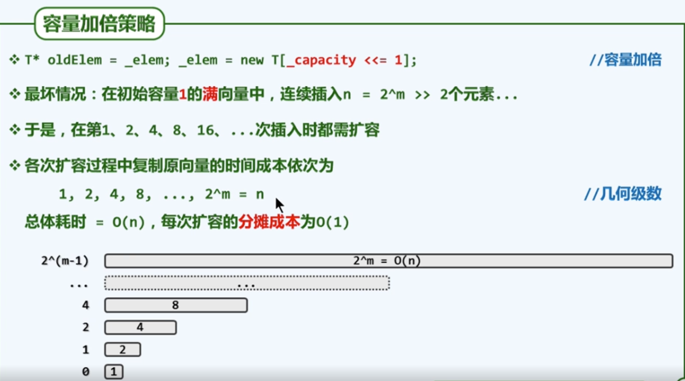
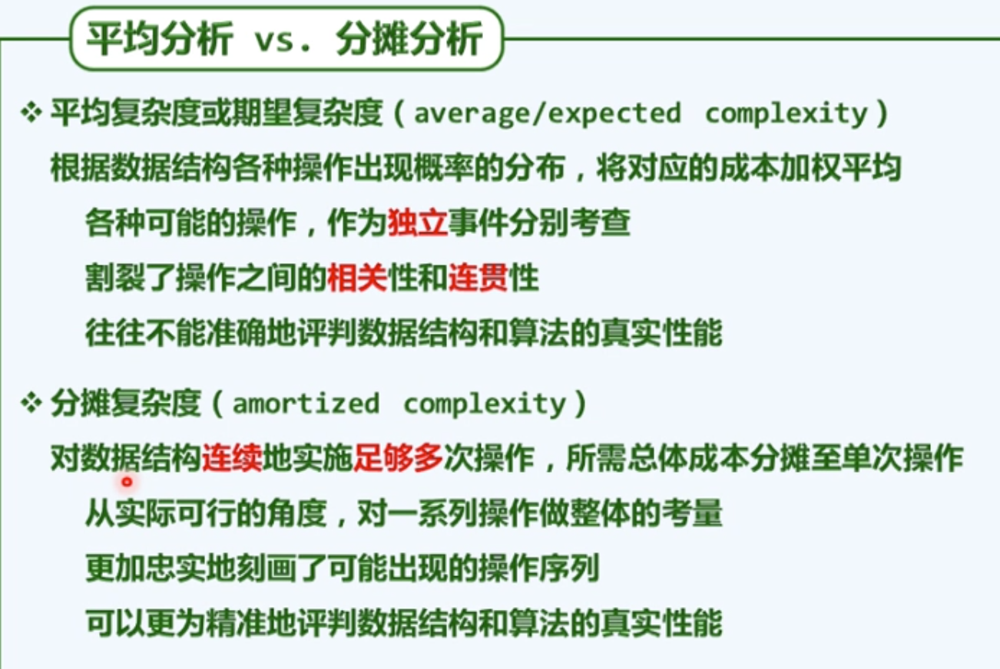
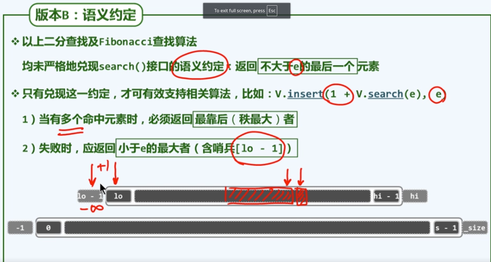

# 抽象数据类型

## 接口与实现

### 向量ADT

向量各元素与 [0,n) 内的秩(rank)一一对应

可以且只能用提供的接口进行操作。

#### 接口

#### 接口操作示例

### 扩容

#### 递增式扩容

#### 加倍式扩容

### 分摊复杂度

### 二分查找

#### 语义

添加两个哨兵lo和hi分别作为负无穷和正无穷

#### 原理

#### 实现

线性递归：$T(n)=T(n/2)+O(1)=O(logn)$ 大大优于顺序查找

递归跟踪：轴点总取中点，递归深度$O(logn)$；各递归实例均耗时$O(1)$

### Fib 查找

#### 实现

#### 最优性证明

### 二分查找（B）

#### 语义约定

#### 实现

不变性：e在[lo,hi) 的范围内

初始时：显而易见

数学归纳：

1. e < A[mi] ， hi=mi 。e在[lo,hi) 的范围内
2. A[mi] <= e，lo=mi。e在[lo,hi) 的范围内

### 版本C

#### 正确性：

## 插值查找

#### 原理

#### 实例

#### 性能分析

##### 形象解释

二分查找在n个数中查找，时间复杂度是 $O(logn)$ 。

这里相当于对 n 的二进制位宽度进行二分查找，时间复杂度是$O(loglogn)$

### 归并排序

#### 实现

#### 正确性

不会覆盖

(b) 中显然有 k>=i，因此C中k之前的元素一定无用了，可以被覆盖掉。唯一从C修改当前未处理的情况就是k==i，将同一个元素搬到同一个位置等于没有修改。因此不会覆盖。

#### 复杂度

