# 栈与队列

### 栈实现

### 应用

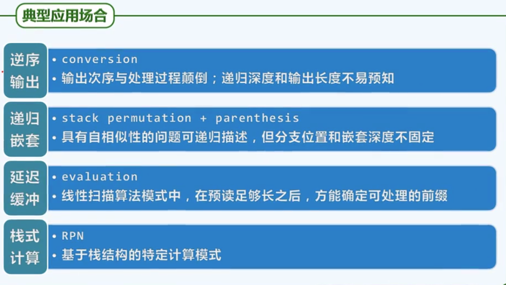

### 栈混洗

#### 概念

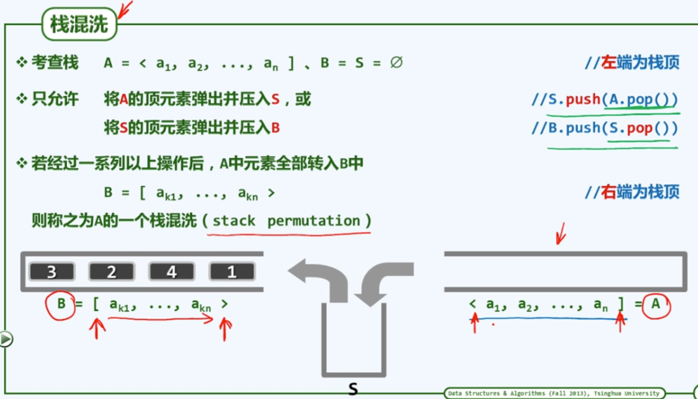

#### 种数

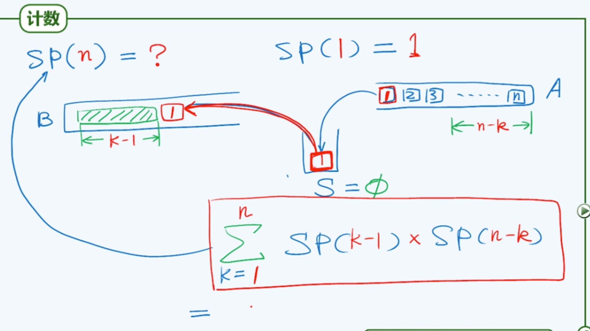

=卡特兰数

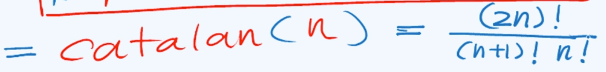

#### 甄别S

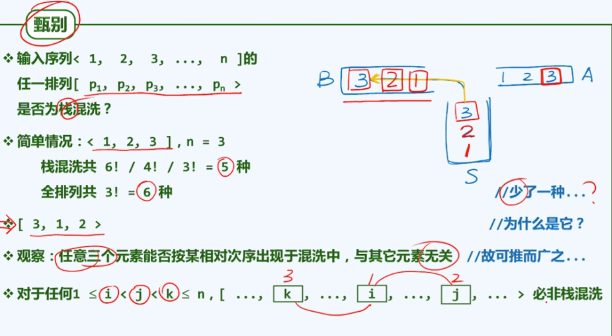

理解：当k在S里的时候，i 和 j 一定不在B中，否则最后肯定排在k的前面。而因为他俩都没有弹出，所以顺序一定是原先栈中的倒序。

这个条件是充要的

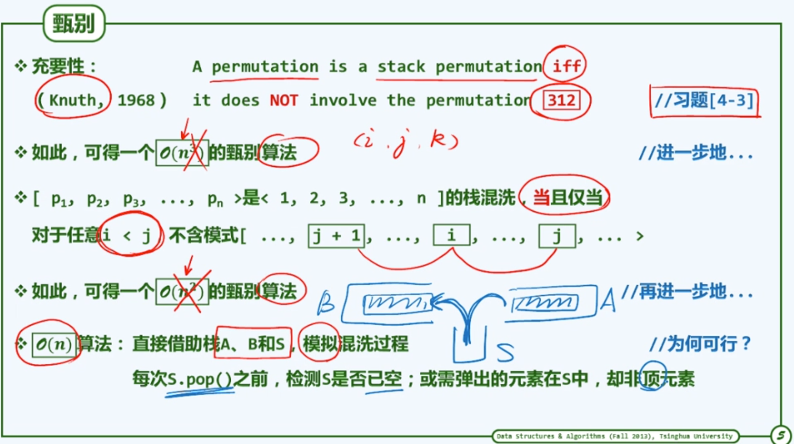

#### 中缀表达式求值

##### 算法框架

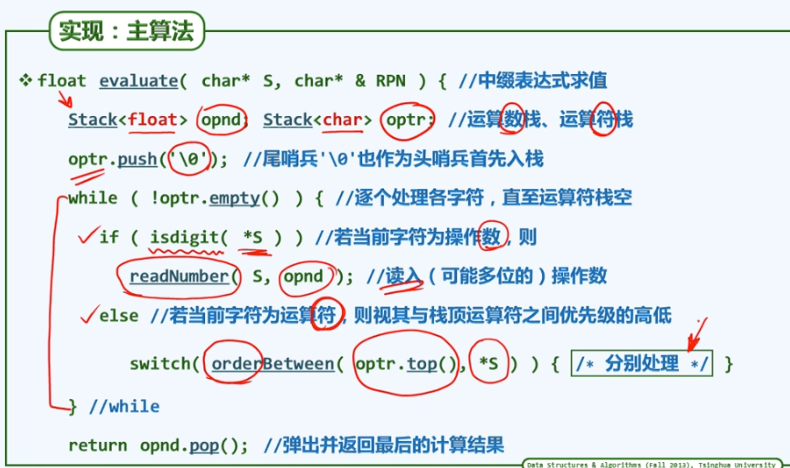

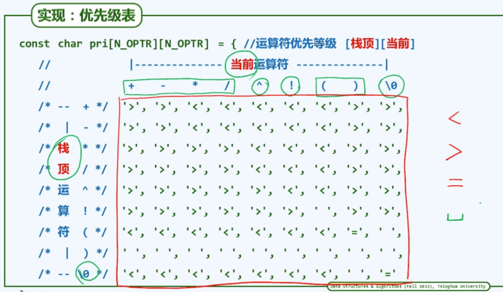

##### 算法细节

##### 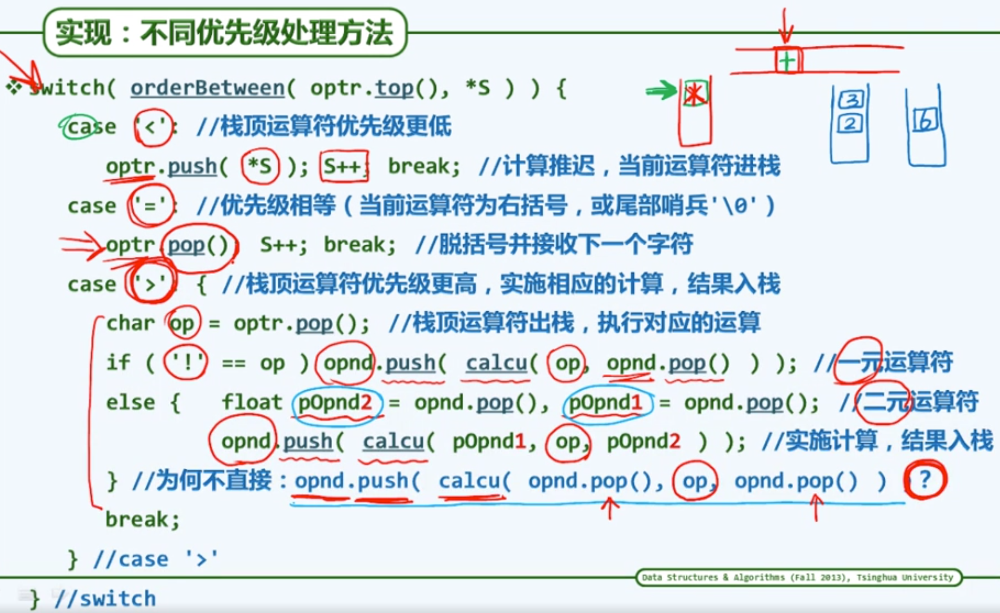

括号相当于一个用优先级最高和一个优先级最低所包围，所以里面的值会被先计算（遇到右括号后，直到左括号才停止计算）

#### 逆波兰表达式

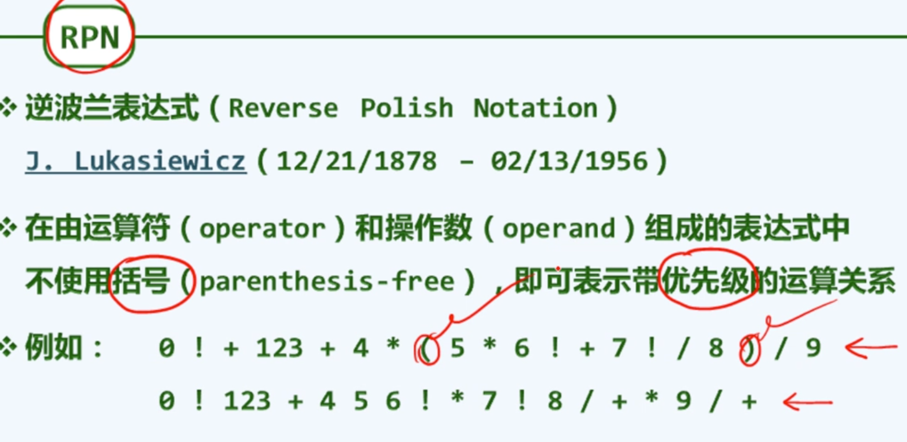

RPN的转化（手工转化）

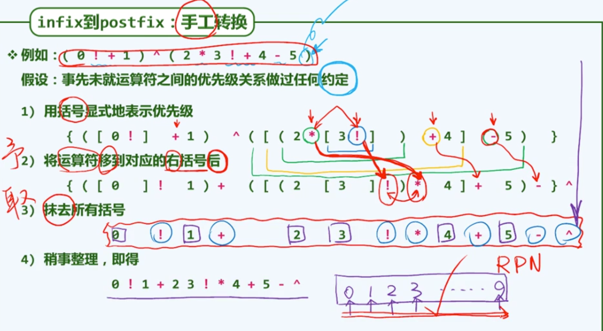

算法

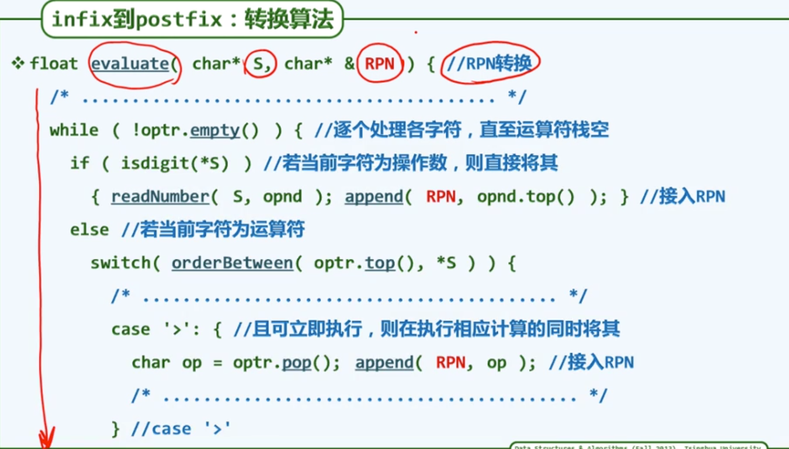

### 队列ADT

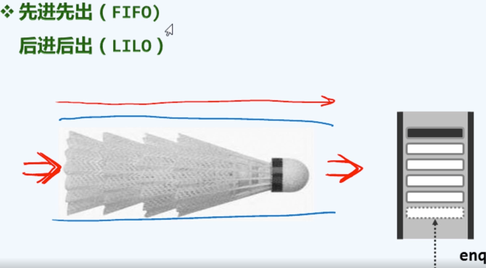

实现：

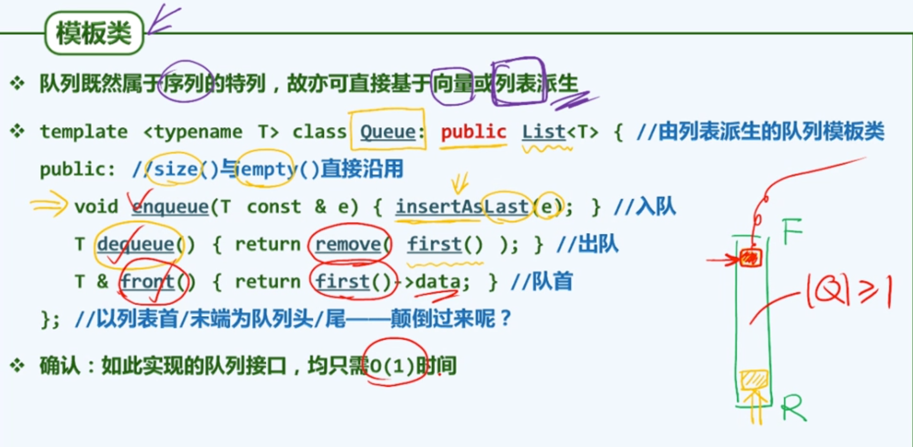

