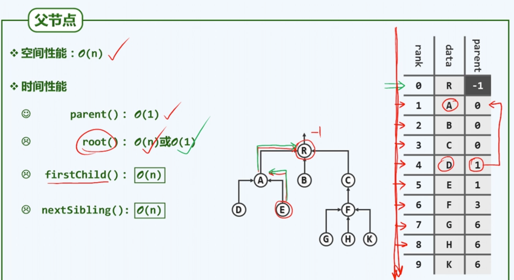
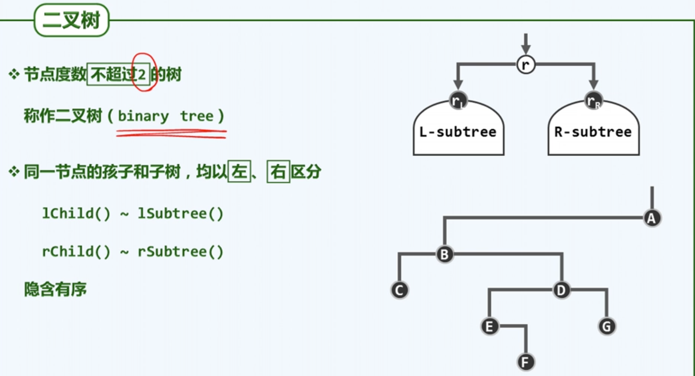
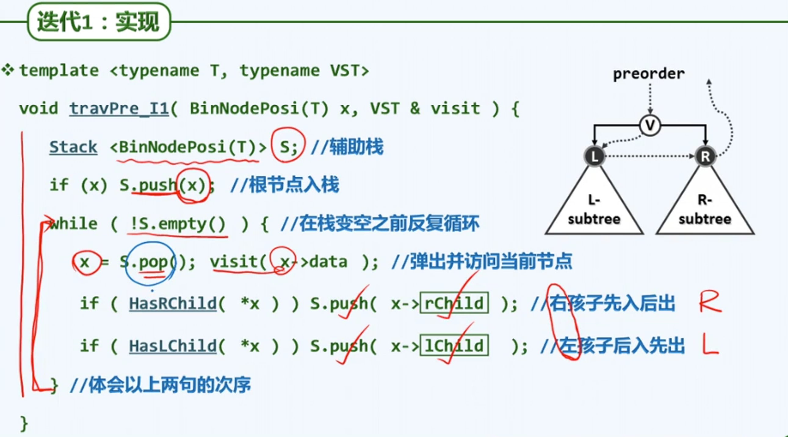
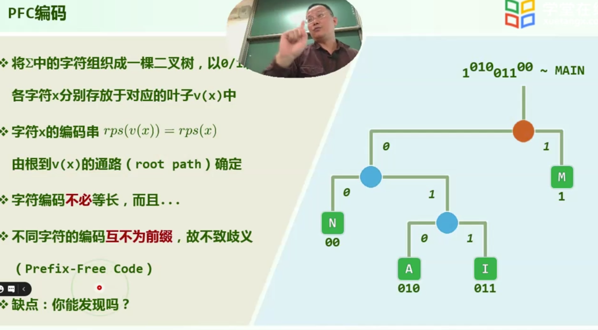

### 树

#### 动机

#### 有根树

如果T1,T2...Td为有根树，那么再引入一个新的节点r。【该节点 与 其他之前已有的节点，以及该节点与其他节点的连接形成的边 与 其他之前原有的边】，这个集合构成了一个新的树。

#### 有序树

边数=所有点的出度之和=顶点总数-1

=》如果将一棵树的规模看作是(n+e)，那么从渐进的意义上看与点数同阶。

#### 路径与环路

#### 连通+无环

每一个点拥有了一个指标：从根节点到该节点的路径长度。

通过这样的指标，可以将所有的节点划分为不同的几类。如此，具有相同指标的也称为等价类。

#### 深度+层次

某一节点的在某一深度的祖先唯一，但后代不一定唯一。

### 树的表示

#### 表示法与接口

#### 父亲

#### 孩子

这个表示法，查找孩子与兄弟的计算量正比于节点的孩子数量，不错。

但向上查找的优势消失殆尽了，需要遍历整个序列来找。

#### 父亲+孩子

这种方法结合了之前两种方法的优势，但仍有美中不足。

缺点在于每个节点所指向的数据集的规模不平衡。本来总数据规模=各节点出度之和=总边数=n-1，是O(n)的。平均到每个节点都是O(1)的数据规模，但是这里有可能在一个节点集中太多数据从而减慢查找效率。

#### 长子+兄弟

### 有根有序树=二叉树

#### 二叉树

#### 真二叉树

每个节点的出度都是偶数（0或2）。为此，可以假想为每个节点添加足够的孩子节点。（并不需要真实添加，只需假想）

从渐进的意义上讲，规模与原先相当。

#### 描述多叉树

#### 二叉树实现

二叉树是一个庞大的家族，每个成员对高度的定义及更新的方法不尽相同，因此将它定义为虚方法，可以便于各种派生类对这个方法进行适当的重写。

#### 高度更新

#### 节点插入

### 先序遍历

二叉树是串性结构，通过某种原则将二叉树转化为某种线性次序，方便研究。

接下来介绍的图结构也有类似的思想，将还不熟的非线性结构转化为较为熟悉的串性结构来处理。

#### 遍历规则

#### 递归实现

#### 迭代实现（1）

#### 迭代实现（2）

将起始于树根的，从沿着左侧分支不断下行的链，称作是当前这颗子树的左侧链。

统一的将二叉树画成这样一个形式：将左侧链的每一个节点突出地绘制出来，每一个节点都有一个右子树（即使可能不存在），其他部分都被归入到这些右子树中。

从宏观上看，先自顶向下遍历左侧链上的节点，然后自底向上依次偏历各个节点上的每一个右子树。

### 中序遍历

#### 递归

#### 观察

节点会将控制权“谦让”给它的左侧分支。

可以将中序遍历分解为在不同尺度下的，一系列对左侧分支的逐步处理。

#### 思路

将二叉树分解为左侧链和左侧链各节点右孩子右子树。

首先得到访问的是左侧链的末端，然后是该节点的右子树。这之后把它的控制权返回上层节点，此时之前的那些左侧节点可以等效看作未曾存在过。

各节点实际被访问的顺序大致自下而上，与“谦让”的方向相反，应该我们应该考虑采用某种后进先出的数据结构。

#### 实现

#### 实例

#### 分摊分析

看似是O($n^2$)，实际所有这些左侧链的长度合在一起也无非是O(n)。

从常系数的意义而言，要远胜于递归的版本。

### 后序遍历

#### 表达式树

### 层次遍历

#### 实现

#### 实例

### 重构

由二叉树可以明确地导出这三个遍历序列。那么反过来，这三个序列能否忠实地还原出原来的树？什么情况下可以，什么情况下不行，如果可以又该使用什么方法。

#### 【先序|后序】+中序

给定先序或后序可以得到树根节点是谁，然后可以在中序序列中对其进行定位。它可以在中序遍历序列中起到一个切分的作用，使我们得以分别确认左子树和右子树所对应的子序列。这样，我们将原来的树的重构问题化简为两个子树的重构问题。

根据归纳假设，两颗子树都可按上面的方法重构。

只凭先序和后序无法保证子树的正确切分。因为当左子树或右子树不存在的时候，还原时无法确定到底缺失的是左子树还是右子树。

#### (先序+后序)x真

真二叉树可以

### Huffman树

#### 无前缀冲突编码

#### 编码成本

如果有高度差>=2的叶子节点，交换不亏。因为叶子的父亲与上面的叶子交换后，平均编码长度与父亲只有一片叶子相同，但此时父亲还能再有一个儿子，就赚了。

#### 带权编码成本

#### 编码算法

#### 构造编码树
