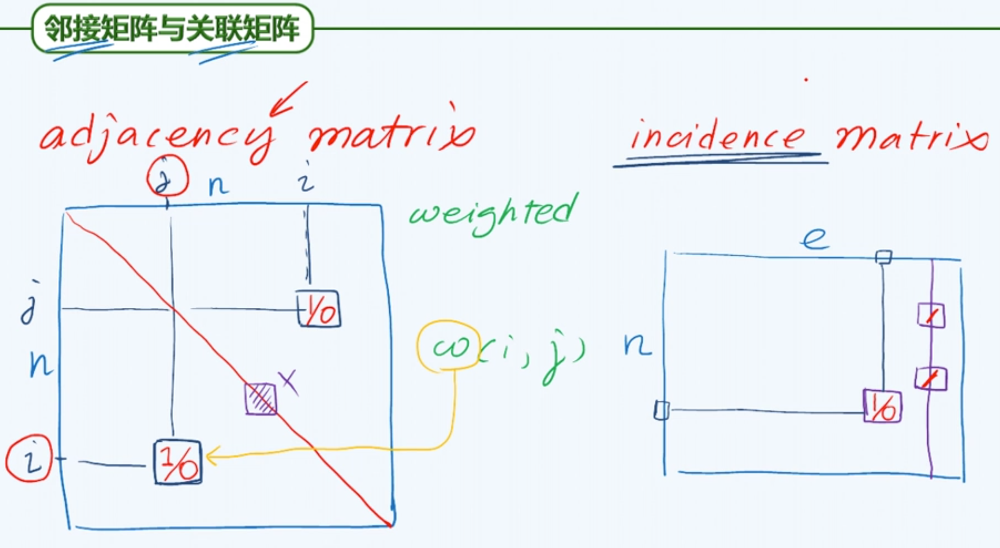
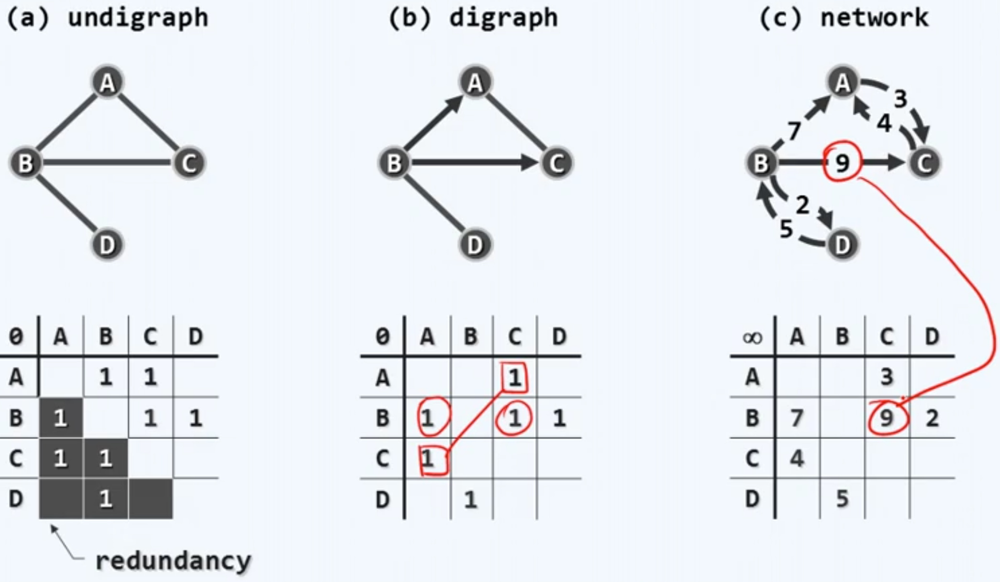
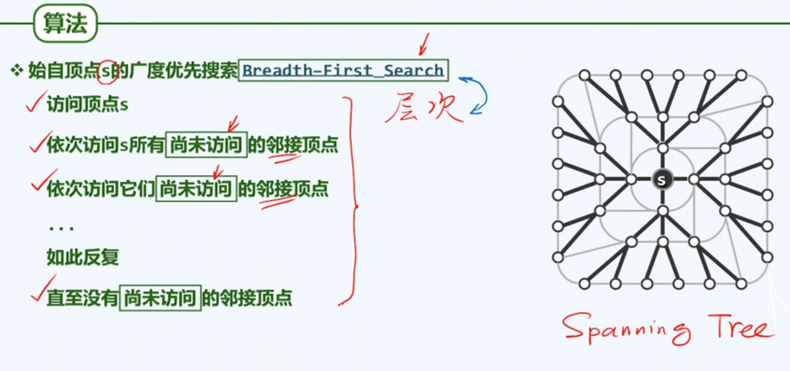

### 概述

#### 邻接+关联

将两个节点之间的关系称作是邻接关系（点与点的关系）

将这个关系与参与定义该关系节点之间的关系称作是关联关系（点与边的关系）

之前的数据结构可以看作是图的特例。

向量或列表可以看作只有互为前驱后继节点可以定义关系；树只有父亲和孩子可以定义关系。

这里我们忽略那些自环的边，不予讨论。

#### 无向+有向

通过有向图可以表示为无向图和混合图，诀窍是可以把任意一条无向边转化为彼此对称的一对有向边。

#### 路径+环路

简单路径就是不含重复节点的路径

经过所有的边一次且恰好一次的环路，叫做欧拉环路。

经过每一个节点依次并且恰好一次，称为哈密尔顿环路。

### 邻接矩阵

#### 接口

#### 邻接矩阵+关联矩阵

##### 邻接矩阵

第i和第j列表示这两个节点之间是否关联，用0/1表示，如果要表示权重，可以改成更大范围的整数。如果是无向图，则这个矩阵对称。

对角线上的元素对应于自环的节点，这里不考虑。

##### 关联矩阵

n行e列（节点数*边数）

不难看出，对于任意一列，有且仅有两个为1。

#### 实例

无向图有明显冗余，每一条边的被记录了两次。

#### 顶点和边

#### 邻接矩阵（代码）

#### 顶点静态操作

将编号n的节点作为一个假想的哨兵，认为它与任意一个节点都相邻。

#### 边操作

##### 边插入

#### 顶点动态操作

边的插入删除，不会使得矩阵规模发生变化。但是顶点的会。

#### 综合评价

##### 优点

##### 缺点

v=顶点数；e=边数；f=区域面片的总数；c=连通域的总数

   

### 广度有限搜索

#### 化繁为简

#### 策略

逐一枚举并访问未曾访问的邻居，加粗的边代表被我们的算法所保留，它们携带了遍历中的信息。这些边构成了极大无环子图（通常是树）；同时，还有一些边不会被广度优先搜索采纳。

算法确定了节点的访问顺序，最后的成果是选自原图的一系列的边。同一等价类内部的边都不会被采纳，被采纳的边来自相邻等价类（但相邻等价类之间的边并不一定被采纳）。

这些边能将所有的节点连接起来，构成一棵树（Spanning Tree）。

#### 实现

#### 多连通

这里并非对每一个节点都启动一次bfs搜索，因为这里只有状态是DISCOVERD才会启动bfs搜索。这样，当访问到上次已经有的连通域的节点时（在上次bfs时被标记为DISCOVERD），这些节点不会启动bfs搜索。等于说每一个连通域启动且只启动一次广度有限搜索。因此，所有花费在搜索上的时间也不过是对全图的一次遍历，而非多次。

#### 复杂度

最外层的while循环迭代次数与第一句dequeue操作执行操作相同，dequeue次数=enqueue次数=n的线性次。所以最外层为O(n)。

将内部的for循环拆解为for循环本身以及进入循环后的操作。for循环本身对顶点v的行向量进行线性扫描，自后向前扫过n个单位。与前面相乘累计复杂度为$O(n*n)$；而for循环内的循环累计不过边的总数。两项合计$O(n*n+e)=O(n*n)$。但是实际运行过程中for循环本身实际花费时间很少，因为操作简单且物理上贴近，便于利用高速缓存。实际上约等于$O(n+e)$。

#### 最短路径

bfs树中两个节点的通路，恰好就是这两个节点间的最短通路。

### 深度有限搜索

#### 算法

#### 框架

#### 细节

#### 实例

##### 无向图

